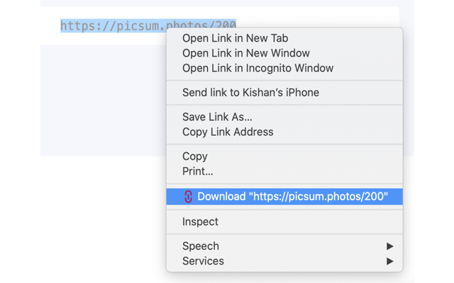

# Text URL Downloader Chrome Extension
Chrome extension to start downloads of urls in text format.
By using the GUI, you can copy and download manually:


Or by simply right-clicking on any url text on any page and selecting the download option:

<br><br><br>

# Install it using the Chrome Web Store
#### Currently unavailable.<br>Awaiting approval.
<br><br>


# Contribute
## Project Structure
* src/typescript: TypeScript source files
* src/assets: static files
* dist: Chrome Extension directory
* dist/js: Generated JavaScript files

## Setup

```
npm install
```
...
## Build
```
npm run build
```
## Build in watch mode
```
npm run watch
```

## Load extension to chrome
Load `dist` directory
